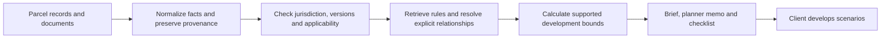

# NashZone

Evidence-linked pre-application research for property development.

NashZone is being built to turn parcel records and planning regulations into a reviewable development brief. Clients can start without a proposed building program: the first output identifies applicable constraints, conditional opportunities, and unresolved questions that help them form a proposal.

## Status

Day 3 geometry prototype: a local interactive height study with four frontage scenarios, road subtraction, top-plate threshold and a 3D surface/stepped view. [Run and methodology](docs/geometry-demo.md). Regulatory research remains incomplete; see the [evidence review and remaining gaps](docs/day-2-evidence-review.md). No final parcel-specific entitlement or LLM report service is available yet.

```sh
npm ci
npm test
npm run dev
```

Open http://127.0.0.1:4317. Defaults: 50,000 sq ft top plate and 10 ft upper-floor height. Geometry is calibrated from a non-survey PDF, with residuals exposed in the UI. No API key required for this demo.

The first case is parcel `11714015900`, Nashville. SCR and Green Hills UDO are case data, not hard-coded product boundaries. Other jurisdictions require their own reviewed source and applicability configuration; cross-city support is not yet validated.

## Workflow



## Day 1 Deliverables

- [Product scope and architecture](docs/product-spec.md)
- [Five-day schedule](docs/five-day-plan.md)
- [Report template](docs/report-template.md)
- [Evaluation and acceptance criteria](docs/evaluation.md)
- [JSON contracts](schemas/contracts.schema.json)
- [Nashville source configuration](jurisdictions/nashville/pack.json)
- [Sample parcel input](examples/nashville-11714015900/input.json)

## Design

Use a typed Python workflow for ingestion, fact normalization, rule retrieval, applicability checks, deterministic calculations, and report validation. The language model extracts and explains evidence; calculation and citation checks remain explicit program steps. Begin with structured files and metadata/keyword retrieval. Select a model and UI implementation after the first verified evidence path works.

Every material finding must link to a source and an applicability rationale. Unknown data remains unknown. Potential incentives are conditional, not promised entitlements. Additional floor area is not a profit estimate.

## Local Validation

Requires Python 3 and `jsonschema` (development dependency in `requirements-dev.txt`).

```sh
python -m pip install -r requirements-dev.txt
python scripts/validate_contracts.py
```

To build the local evidence library, install Poppler, place the supplied PDF at the repository root, and run `python scripts/build_evidence.py`. Extracted source text remains under ignored `data/local/`. Rule seeds preserve evidence and conditions; they are not an automated legal determination.

## Publication Plan

GitHub Pages deployment is configured for this repository's main branch. Follow the [GitHub Desktop publishing steps](docs/github-pages.md). Expected URL after successful deployment: https://daisy91222.github.io/NashZone/ . The local configuration has been prepared; remote publication is not yet confirmed.

The workflow tests and builds the browser-only geometry demo automatically on push. Future live model calls require a separate backend with server-side credentials. Original PDF and AI files stay local; the published demo uses derived geometry.

## Limits

Outputs support preliminary research and professional review. Current code, amendments, parcel-specific ordinances and official interpretations must be checked before relying on a development conclusion. No accuracy, speed, savings or financial-return metrics have been measured.
