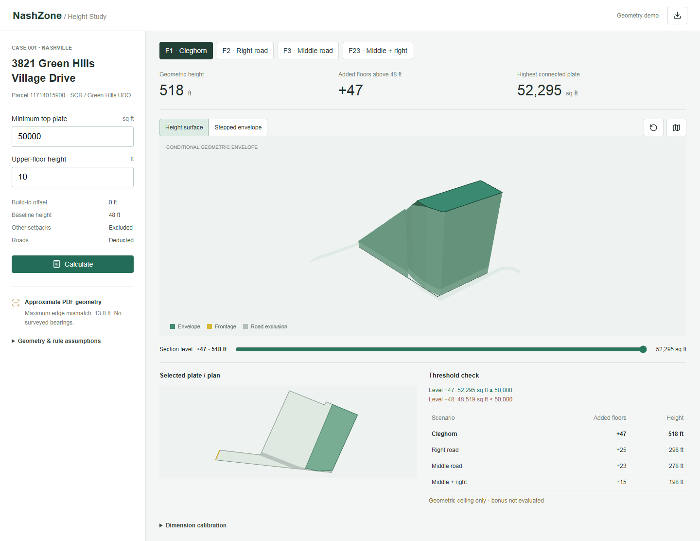
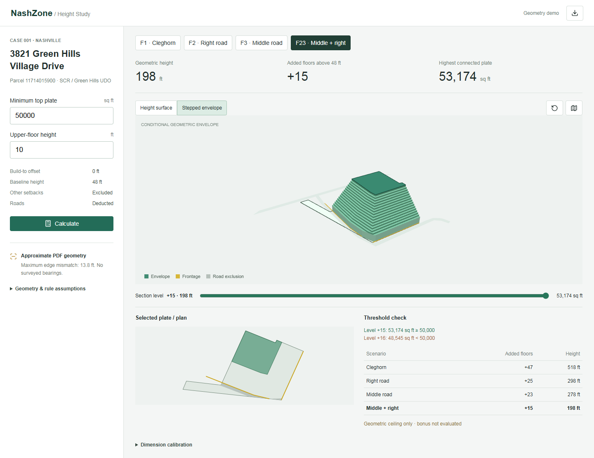

# NashZone

**From planning regulations to reviewable development scenarios.**

NashZone is a pre-application intelligence agent project for planners, developers, and property owners exploring what a site could become. It combines source-linked regulatory research with repeatable spatial calculations, helping clients investigate development options before committing to a building program.

**[Open the live demo](https://daisy91222.github.io/NashZone/)** | [Calculation methodology](docs/geometry-demo.md) | [Regulatory evidence](docs/day-2-evidence-review.md)

The current public demo implements the **geometric analysis component**: four frontage scenarios, road exclusions, configurable top-floor area and floor height, and interactive 3D envelopes. A local document-extraction workflow and initial rule library support regulatory research. Automated LLM retrieval, legal applicability resolution, and end-to-end report generation are still under development.

## Use Cases

| User | Question | Current support |
| --- | --- | --- |
| Developer or property owner | How does frontage selection affect development potential? | Compare geometric height envelopes before selecting a detailed building program. |
| Planner or urban designer | What happens when two road-facing edges constrain a building together? | Inspect combined retreat constraints in plan, height-surface, and stepped-envelope views. |
| Planning consultant | Which assumptions produced this result? | Review inputs, per-level areas, the stopping threshold, and exported JSON. |
| AI / geospatial developer | How can regulatory evidence inform spatial analysis? | Reuse source contracts and geometry routines while adapting local rules and inputs. |

The first case is **3821 Green Hills Village Drive, Nashville**, parcel `11714015900`, using SCR and Green Hills UDO materials. It provides a concrete case for developing the broader workflow; it does not establish coverage of all Nashville properties or other cities.

## Explore the Demo

[](https://daisy91222.github.io/NashZone/)

*Live application capture: the Cleghorn frontage height surface. Heights shown are conditional geometric results, not approved development rights.*

1. Select **Cleghorn**, **right internal road**, **middle internal road**, or **middle + right**.
2. Enter a minimum top-floor plate area and upper-floor height. Defaults are **50,000 sq ft** and **10 ft**.
3. Calculate and compare height, added floors, and remaining top plate.
4. Switch between the height surface and stepped envelope, rotate the model, and inspect individual levels.
5. Download JSON containing the calculation inputs, geometry, assumptions, and threshold results.

[](https://daisy91222.github.io/NashZone/)

*Two frontages applied simultaneously. The calculation intersects their retreat constraints instead of adding independent scenario results. The threshold audit displays the last passing floor and the next failing floor.*

## Efficiency Improvements

The implemented workflow reduces repeated setup and calculation work:

| Repeated task | Implemented support |
| --- | --- |
| Rebuild a model for each frontage interpretation | Evaluate four configured scenarios using shared parcel and road geometry. |
| Recalculate after changing a plate-size threshold or floor height | Recompute all scenarios from two editable inputs. |
| Manually find the last floor that fits | Check consecutive retreat levels and display the stopping threshold. |
| Reconcile disconnected fragments after road subtraction | Test the largest connected plate rather than incorrectly summing separate pieces. |
| Assemble a record of assumptions and results | Export the calculation context and geometry together. |
| Repeatedly locate source pages during research | Locally extract page indexes and rule seeds with physical and printed page references. |

These are functional improvements, **not measured productivity claims**. A controlled comparison with a manual Rhino workflow has not been completed. Time savings, review accuracy, and financial benefits have not been quantified. The [evaluation plan](docs/evaluation.md) distinguishes evidence quality, numerical correctness, and future workflow benchmarking.

## Reusability

The project separates parcel geometry, regulatory evidence, and scenario inputs:

- **Geometry:** boundary, road exclusions, selected frontage lines, units, and inward direction.
- **Evidence:** source identity, page/section references, rule type, applicability conditions, and unresolved questions.
- **Parameters:** minimum top plate, upper-floor height, and frontage combination.

The polygon clipping and area routines can be reused with compatible geometry. The current interface is configured for one parcel; its **48-ft baseline, 10-ft retreat, frontage selection, and exclusion of other setbacks are case-specific**. A new site requires adapted geometry and reviewed rules. Arbitrary parcel upload and cross-city analysis are not yet implemented.

The [JSON contracts](schemas/contracts.schema.json) and [jurisdiction configuration](jurisdictions/nashville/pack.json) provide a starting point for additional zoning and overlay materials. A future Rhino.Compute / Grasshopper adapter could exchange parcel and floor contours with an existing design workflow. That integration is not yet connected.

## Calculation Workflow

```text
Parcel + road geometry + selected frontage(s)
                    |
Deduct roads and apply inward retreat at each level
                    |
Measure the largest connected remaining floor plate
                    |
Find the last level meeting the minimum area
                    |
Display the envelope, threshold audit, and export
```

For the current case, geometric height is `48 ft + added floors × input floor height`. Horizontal retreat is 10 ft per added floor. The area threshold determines the last retained level; changing vertical floor height does not change how many retreat steps fit.

**FAR exemptions and bonus area remain separate.** The demo does not establish whether sufficient bonus exists to support the upper floors. The planned agent will connect findings to evidence and expose missing information before presenting development conclusions.

## Implementation and Validation

- **Computation:** polyclip-ts polygon difference/intersection and connected-plate area checks.
- **Visualization:** Three.js with orbit, plan, height-surface, and stepped-envelope views.
- **Research tooling:** Python PDF extraction, JSON Schema contracts, source metadata, and rule seeds.
- **Delivery:** Vite and GitHub Pages; the public geometry demo runs in the browser without a model API key.

Numerical tests cover analytical rectangles, combined frontage constraints, road subtraction, disconnected plates, monotonicity, and invalid inputs. Browser checks cover desktop/mobile rendering, visible canvas geometry, camera interaction, edited parameters, infeasible cases, and export. These validate software behavior, not legal interpretation.

## Run Locally

Requires Node.js 24 and npm:

```sh
npm ci
npm test
npm run dev
```

Open the URL printed in the terminal. For a production build, run `npm run build` followed by `npm run preview`. Derived geometry is included; the public demo does not require the original PDF or Illustrator file. See the [methodology](docs/geometry-demo.md) for local source extraction and validation instructions.

## Scope and Data Quality

Geometry was extracted from a user-supplied vector PDF and fitted to its dimension labels. The largest edge mismatch is approximately **13.8 ft**, with residuals visible in the application. Road boundaries are diagram-based approximations, not verified survey or easement data. No other setbacks are modeled in this experiment.

Results support preliminary scenario review. Current zoning, parcel-specific amendments, frontage recognition, incentive eligibility, and remaining development standards require verification before relying on a height conclusion. The project does not calculate maximum total building area, certify approvals, or predict profitability.

## Documentation and Next Steps

- [Product scope and agent architecture](docs/product-spec.md)
- [Geometry model, assumptions, and default results](docs/geometry-demo.md)
- [Regulatory findings and evidence gaps](docs/day-2-evidence-review.md)
- [Report template: constraints, planner memo, and checklist](docs/report-template.md)
- [Evaluation plan](docs/evaluation.md)
- [GitHub Pages publishing instructions](docs/github-pages.md)

Next priorities are verified regulatory retrieval, rule applicability checks, and a source-linked client report connecting the geometry module to the broader pre-application workflow.
